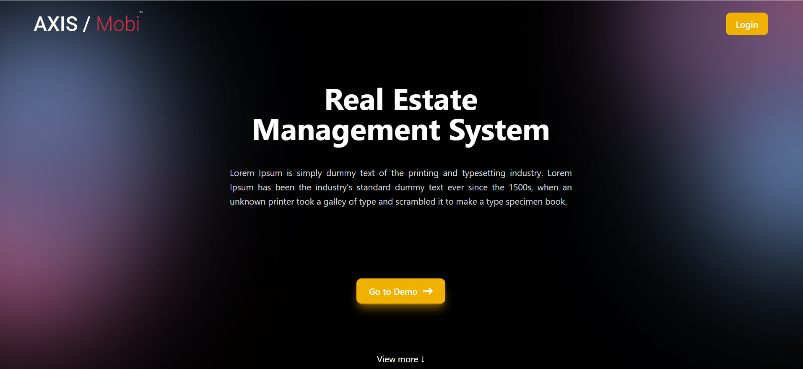

```md
# 🏡 Real Estate Management System

A user-friendly Real Estate Management System that allows users to explore and purchase real estate properties through an interactive interface.

## 🚀 Features

- **Landing Page**: Users can explore a demo of available properties.
- **Product Selection**: Users can add multiple properties to their cart.
- **Signup Page**: Mandatory signup before checkout for future reference.
- **Checkout Process**: Seamless checkout experience after signup.
- **Loading Page**: Transition before accessing the dashboard.
- **User Dashboard**: Personalized space for managing selected properties.

## 📌 Project Structure

1. **Landing Page** – Entry point with a product demo.
2. **Product Selection** – Users add properties to their cart.
3. **Signup Page** – Required before proceeding to checkout.
4. **Checkout & Loading Page** – Checkout process followed by a transition screen.
5. **Dashboard** – Users access their personalized dashboard.

## 🛠 Tech Stack

- **Frontend**: React.js, Tailwind CSS
- **Backend**: Node.js, Express.js
- **Database**: MongoDB
- **Authentication**: JWT, Firebase Auth
- **State Management**: Redux Toolkit
- **Icons**: React Icons

## 📸 Screenshots



## 🔧 Installation & Setup

1. Clone the repository:
   ```sh
   git clone https://github.com/yourusername/real-estate-management.git
   cd real-estate-management
   ```
2. Install dependencies:
   ```sh
   npm install
   ```
3. Start the development server:
   ```sh
   npm run dev
   ```

## 🤝 Contributing

Contributions are welcome! Feel free to submit a pull request.

## 📄 License

MIT License © 2025 Pushkar Raj
```
